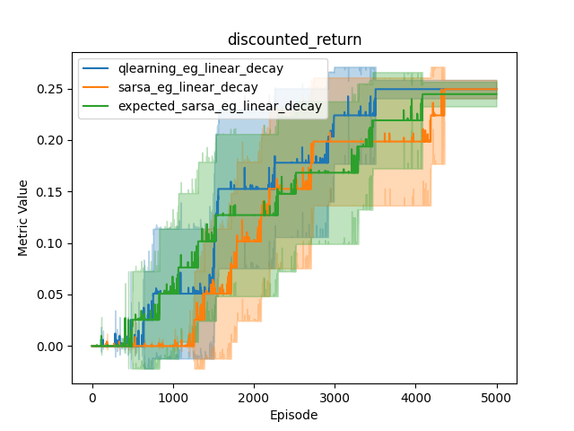
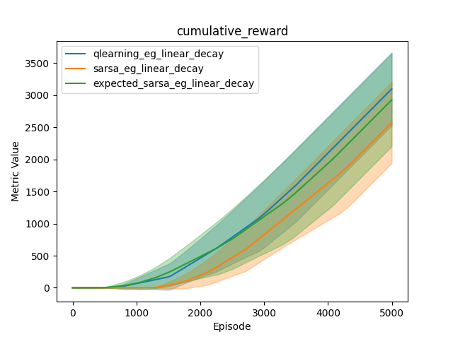

# rl-menagerie
Implementations of common reinforcement learning algorithms

## 1. Algorithms
| Implemented | Algorithm Name      | Update Equation                                                                                           |
|---------|---------------------|-----------------------------------------------------------------------------------------------------------|
| ✓ | Q Learning          | $Q(s, a) \leftarrow Q(s, a) + \alpha \left( r + \gamma \max_{a'} Q(s', a') - Q(s, a) \right)$               |
| ✓ | SARSA               | $Q(s, a) \leftarrow Q(s, a) + \alpha \left( r + \gamma Q(s', a') - Q(s, a) \right)$                          |
| ✓ | Double Q Learning   | $Q_1(s, a) \leftarrow Q_1(s, a) + \alpha \left( r + \gamma Q_2(s', \arg\max_{a'} Q_1(s', a')) - Q_1(s, a) \right)$   $Q_2(s, a) \leftarrow Q_2(s, a) + \alpha \left( r + \gamma Q_1(s', \arg\max_{a'} Q_2(s', a')) - Q_2(s, a) \right)$ |
| ✓ | Expected SARSA      | $Q(s, a) \leftarrow Q(s, a) + \alpha \left( r + \gamma \sum_{a'} \pi(a' \| s') Q(s', a') - Q(s, a) \right)$  |
| | Monte Carlo         | $Q(s, a) \leftarrow Q(s, a) + \alpha \left( G_t - Q(s, a) \right)$                                       |
| | TD(Lambda)          | $z(s, a) \leftarrow \gamma \lambda z(s, a) + \nabla Q(s, a)$   $\delta \leftarrow r + \gamma Q(s', a') - Q(s, a)$   $w \leftarrow w + \alpha \delta z(s, a)$|
| | Dyna                | $Q(s, a) \leftarrow Q(s, a) + \alpha \left( r + \gamma \max_{a'} Q(s', a') - Q(s, a) \right)$   $r, s' \leftarrow Model(s, a)$              |

## 2. Frozen Lake

### 2.1. Agent sweep

    
    

The above plots show learning curves for Q-Learning, SARSA and Expected SARSA for an 8x8 Frozen Lake environment (random seed 42), averaged over 10 trials. 
The fill area represents 95% confidence interval over the trials.

Q-learning and Expected SARSA perform similarly, with SARSA performing less well. 

Double Q-learning was implemented too, and proved slow to learn (see below, vs (single) Q-learning).
Double Q-learning addresses the "maximisation bias" error, the motivation for which is clearly stated with the two-state MDP in Sutton & Barto 135: moving right terminates with 0 reward, moving left generates 0 reward then leads to a termination with normally distributed reward (mean -0.1, variance 1) and termination. Moving right is the correct action, but simple Q learners will initially prefer left.

Double Q-learning updates its 2 Q tables at half-frequency with a coin flip, although I can't find many descriptions on the web for it being a slow learner. A TODO is to check my implementation is right here.
