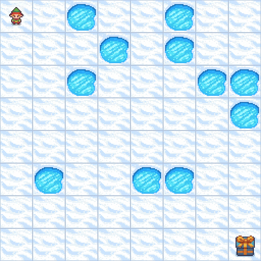
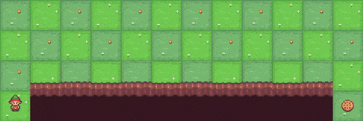
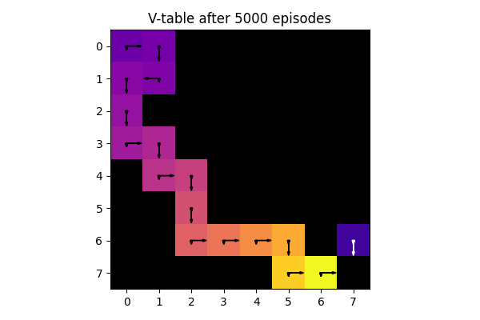
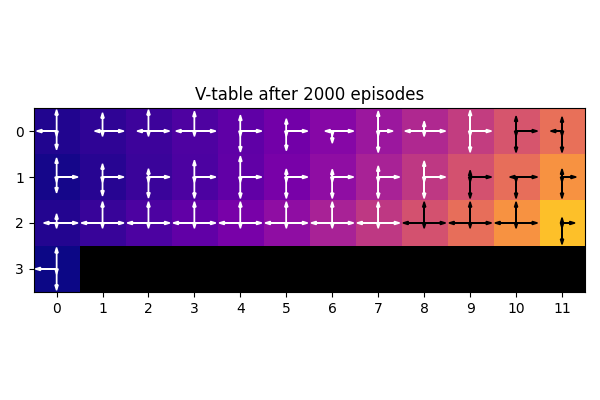
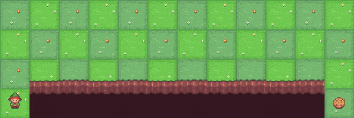
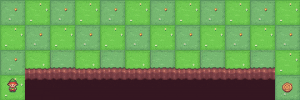
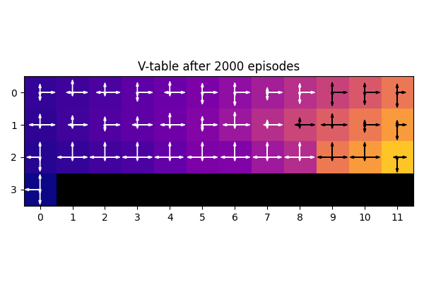
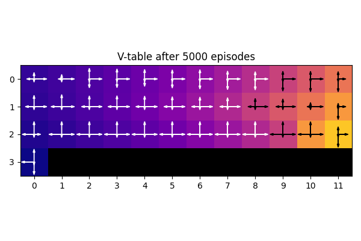

# rl-menagerie
Implementations of common (vanilla) reinforcement learning algorithms, as described in Sutton & Barto. Agents are tested on environments in Gymnasium's Toy Text set.

| Frozen Lake (8x8) | Cliff Walker |
| --- | --- |
|  |  |
|  |  |

## 1. Summary

### 1.1. Agents
| Implemented | Algorithm Name      | Update Equation                                                                                           |
|---------|---------------------|-----------------------------------------------------------------------------------------------------------|
| ✓ | Q Learning          | $Q(s, a) \leftarrow Q(s, a) + \alpha \left( r + \gamma \max_{a'} Q(s', a') - Q(s, a) \right)$               |
| ✓ | SARSA               | $Q(s, a) \leftarrow Q(s, a) + \alpha \left( r + \gamma Q(s', a') - Q(s, a) \right)$                          |
| ✓ | Double Q Learning   | $Q_1(s, a) \leftarrow Q_1(s, a) + \alpha \left( r + \gamma Q_2(s', \arg\max_{a'} Q_1(s', a')) - Q_1(s, a) \right)$   $Q_2(s, a) \leftarrow Q_2(s, a) + \alpha \left( r + \gamma Q_1(s', \arg\max_{a'} Q_2(s', a')) - Q_2(s, a) \right)$ |
| ✓ | Expected SARSA      | $Q(s, a) \leftarrow Q(s, a) + \alpha \left( r + \gamma \sum_{a'} \pi(a' \| s') Q(s', a') - Q(s, a) \right)$  |
| | Monte Carlo         | $Q(s, a) \leftarrow Q(s, a) + \alpha \left( G_t - Q(s, a) \right)$                                       |
| | TD(Lambda)          | $z(s, a) \leftarrow \gamma \lambda z(s, a) + \nabla Q(s, a)$   $\delta \leftarrow r + \gamma Q(s', a') - Q(s, a)$   $w \leftarrow w + \alpha \delta z(s, a)$|
| | Dyna                | $Q(s, a) \leftarrow Q(s, a) + \alpha \left( r + \gamma \max_{a'} Q(s', a') - Q(s, a) \right)$   $r, s' \leftarrow Model(s, a)$              |

### 1.2. Behaviour Policies
| Implemented | Policy | Motivation |
|---|---|---|
| ✓ | Epsilon-Greedy // no decay | Simplest |
| ✓ | Epsilon-Greedy // linear decay | Exploit, once good value function learnt |
| ✓ | Epsilon-Greedy // exponential decay | Potentially more efficient decay schedule: quicker decay during steep early learning curve |
| ✓ | Softmax | Less information loss applied to Q-function; sensitive to temperature parameter. Differentiable if used for target policy |
|  | Mellowmax | Differentiable, allows convergent behaviour in learning and planning |
|  | Soft mellowmax | Adresses oversmoothing problem of mellowmax |

### 1.3. Environments
| Implemented | Environment Name | Motivation |
|---|---|---|
| ✓ | Frozen Lake default (4x4) | One of the simplest Gymnasium environments |
| ✓ | Frozen Lake custom (8x8, random seed 42) | Get a feel for reward sparsity and its effect on training for larger environments |
| ✓ | Cliff Walker | Demonstrate SARSA's more cautious value function, as Sutton & Barto pp. 132 |
| | Taxi | More complex action space |
| | Blackjack| More complex MDP |

### 1.4. Initialisation strategy
| Implemented | Initialisation | Motivation |
|---|---|---|
| ✓ | Zero initialisation | Simple baseline |
| | Optimistic initialisation | Encourages greater early exploration (try with frozen lake (perhaps with higher "hole" density), where current Q table shows little exploration off the beaten track) |

## 2. Frozen Lake

### 2.1. Agent sweep

    
    

The above plots show learning curves for Q-Learning, SARSA and Expected SARSA for an 8x8 Frozen Lake environment (random seed 42), averaged over 10 trials. 
The fill area represents 95% confidence interval over the trials.

All agents had an epsilon-greedy policy which decayed epsilon over the trial period.

Q-learning and Expected SARSA perform similarly, with SARSA taking a little longer to learn. 

Double Q-learning was implemented too, and proved slow to learn (see below, vs (single) Q-learning).
Double Q-learning addresses the "maximisation bias" error, the motivation for which is clearly stated with the two-state MDP in Sutton & Barto 135: moving right terminates with 0 reward, moving left generates 0 reward then leads to a termination with normally distributed reward (mean -0.1, variance 1) and termination. Moving right is the correct action, but simple Q learners will initially prefer left.

Double Q-learning updates its 2 Q tables at half-frequency with a coin flip, although I can't find many descriptions on the web for it being a slow learner. A TODO is to check my implementation is correct here. It could also be an interaction with the linear epsilon decay scheme, decaying too fast before exploration complete.

    

## 3. Cliff Walking

This environment is introduced in pp. 1323 of Sutton & Barto, the motivation being to demonstrate SARSA taking a safer path (due to waiting for next action A' before updating the value function) than Q learning.

As with Sutton & Barto, here I did not decay epsilon in the epsilon-greedy action selection schedule. Q learning thus performs worse, as it takes the optimal path close to the cliff edge, which pays off the majority of the time (-13 reward, vs ~-16 for the safer path), but every so often the agent goes **stochastic lemming** for a -100 payoff.

Interestingly, the SARSA agent is slightly more daring here than in Sutton & Barto: it picks a route which is 1- rather than 2-squares offset from the cliff edge.

    
    

| Q-Learning (after 2000 training episodes) | SARSA (after 2000 training episodes) | Expected SARSA (after 2000 training episodes) |
| --- | --- | --- |
|  |  |  |
|  |  |  |

## 4. Usage
1. In `training_configs.py`:
    1. Define a list of environment configs in ENVIRONMENT_CONFIGS (can be a list of length 1, or greater)
    2. Define a list of agent configs in AGENT_CONFIGS (can be a list of length 1, or greater)
    3. (This script then generates TRAINING_CONFIGS: an outer product of the environment and agent configs)
2. Run `training.py`:
    1. This will loop over all specified runs in TRAINING_CONFIGS
    2. Each run is given a UUID
    3. Run results are added to a run log in `.../experiments/.cache`
    4. Intermediate plots and training artefacts are added to a directory (`.../.cache/<run UUID>/`)
3. Generate plots and videos of selected sweeps in `evaluation.py`
    1. Look through the run log in `.cache` to get the desired runs to analyse
    2. Set `EVAL_NAME`: this is used to create an evaluation directory for the given sweep
    3. Set `RUN_DIRECTORIES`: a {save_name: run UUID} dictionary specifying the runs to analyse
   
## 5. Future work
- TODO: hyperparameter grid search of behaviour policy parameters (policies in table 1.2). 4-5 settings for learning rate & 4-5 settings for policy parameter (epsilon, or tao temperature parameter for softmax). Plot heatmap of best performance metric (discounted return, averaged across trials) for gridsearch grid
- TODO: refactor training script so that intermediate checkpoints save a full pickle of the agent (currently saving just the Q table, but this is fairly specific for Q-learning-based agents; currently load doesn't work for Double Q Learning agent with multiple Q table attributes)
- TODO: Tick off more of the tables above. Would be interesting to see optimistic evaluation and model-based planners/learners (Dyna-Q) on a more challenging Frozen Lake (higher hole density). Interesting too to train for the Taxi environment
- TODO: Sanity check Double Q Learning. Implement simple demo environment in S&B pp. 135 to check it avoids maximisation bias correctly
- TODO: Check "best_avg_episode_reward" log in runlog is implemented correctly (for Cliff Walker, numbers look suspicious - -ve version of best average episode length)
