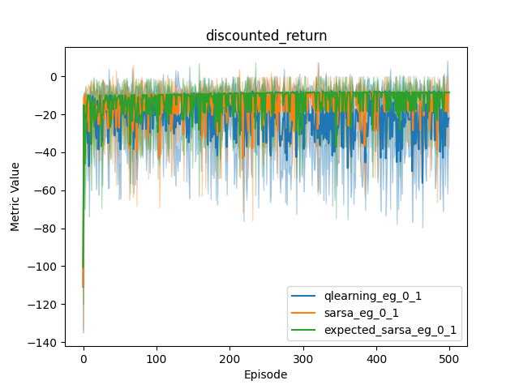

# rl-menagerie
Implementations of common reinforcement learning algorithms
| Frozen Lake (8x8) | Cliff Walker |
| --- | --- |
|  |  |
|  |  |

## 1. Summary

### 1.1. Agents
| Implemented | Algorithm Name      | Update Equation                                                                                           |
|---------|---------------------|-----------------------------------------------------------------------------------------------------------|
| ✓ | Q Learning          | $Q(s, a) \leftarrow Q(s, a) + \alpha \left( r + \gamma \max_{a'} Q(s', a') - Q(s, a) \right)$               |
| ✓ | SARSA               | $Q(s, a) \leftarrow Q(s, a) + \alpha \left( r + \gamma Q(s', a') - Q(s, a) \right)$                          |
| ✓ | Double Q Learning   | $Q_1(s, a) \leftarrow Q_1(s, a) + \alpha \left( r + \gamma Q_2(s', \arg\max_{a'} Q_1(s', a')) - Q_1(s, a) \right)$   $Q_2(s, a) \leftarrow Q_2(s, a) + \alpha \left( r + \gamma Q_1(s', \arg\max_{a'} Q_2(s', a')) - Q_2(s, a) \right)$ |
| ✓ | Expected SARSA      | $Q(s, a) \leftarrow Q(s, a) + \alpha \left( r + \gamma \sum_{a'} \pi(a' \| s') Q(s', a') - Q(s, a) \right)$  |
| | Monte Carlo         | $Q(s, a) \leftarrow Q(s, a) + \alpha \left( G_t - Q(s, a) \right)$                                       |
| | TD(Lambda)          | $z(s, a) \leftarrow \gamma \lambda z(s, a) + \nabla Q(s, a)$   $\delta \leftarrow r + \gamma Q(s', a') - Q(s, a)$   $w \leftarrow w + \alpha \delta z(s, a)$|
| | Dyna                | $Q(s, a) \leftarrow Q(s, a) + \alpha \left( r + \gamma \max_{a'} Q(s', a') - Q(s, a) \right)$   $r, s' \leftarrow Model(s, a)$              |

### 1.2. Behaviour Policies
| Implemented | Policy | Motivation |
|---|---|---|
| ✓ | Epsilon-Greedy // no decay | Simplest |
| ✓ | Epsilon-Greedy // linear decay | Exploit, once good value function learnt |
| ✓ | Epsilon-Greedy // exponential decay | Potentially more efficient decay schedule: quicker decay during steep early learning curve |
| ✓ | Softmax | Less information loss applied to Q-function; sensitive to temperature parameter. Differentiable if used for target policy |
|  | Mellowmax | Differentiable, allows convergent behaviour in learning and planning |
|  | Soft mellowmax | Adresses oversmoothing problem of mellowmax |

### 1.3. Environments
| Implemented | Environment Name | Motivation |
|---|---|---|
| ✓ | Frozen Lake default (4x4) | One of the simplest Gymnasium environments |
| ✓ | Frozen Lake custom (8x8, random seed 42) | Get a feel for reward sparsity and its effect on training for larger environments |
| ✓ | Cliff Walker | Demonstrate SARSA's more cautious value function, as Sutton & Barto pp. 132 |
| | Taxi | More complex action space |
| | Blackjack| More complex MDP |

## 2. Frozen Lake

### 2.1. Agent sweep

    
    

The above plots show learning curves for Q-Learning, SARSA and Expected SARSA for an 8x8 Frozen Lake environment (random seed 42), averaged over 10 trials. 
The fill area represents 95% confidence interval over the trials.

All agents had an epsilon-greedy policy which decayed epsilon over the trial period.

Q-learning and Expected SARSA perform similarly, with SARSA taking a little longer to learn. 

Double Q-learning was implemented too, and proved slow to learn (see below, vs (single) Q-learning).
Double Q-learning addresses the "maximisation bias" error, the motivation for which is clearly stated with the two-state MDP in Sutton & Barto 135: moving right terminates with 0 reward, moving left generates 0 reward then leads to a termination with normally distributed reward (mean -0.1, variance 1) and termination. Moving right is the correct action, but simple Q learners will initially prefer left.

Double Q-learning updates its 2 Q tables at half-frequency with a coin flip, although I can't find many descriptions on the web for it being a slow learner. A TODO is to check my implementation is correct here. It could also be an interaction with the linear epsilon decay scheme, decaying too fast before exploration complete.

    

## 3. Cliff Walking

This environment is introduced in pp. 1323 of Sutton & Barto, the motivation being to demonstrate SARSA taking a safer path (due to waiting for next action A' before updating the value function) than Q learning.

As with Sutton & Barto, here I did not decay epsilon in the epsilon-greedy action selection schedule. Q learning thus performs worse, as it takes the optimal path close to the cliff edge, which pays off the majority of the time (-13 reward, vs -17 for the safer path), but every so often the agent goes **stochastic lemming** for a -100 payoff.

    
    

